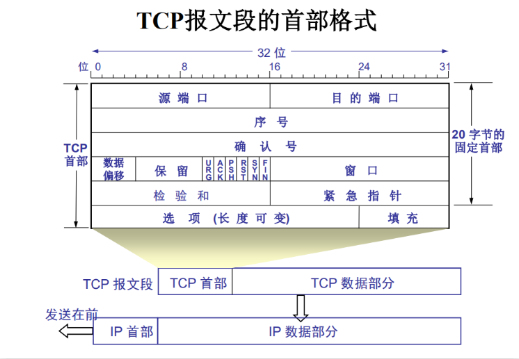

# 简介

TCP（Transmission Control Protocol，传输控制协议）是互联网协议套件中的一个核心协议，主要用于在网络中的计算机之间提供可靠的、面向连接的数据传输服务。TCP是面向字节流的协议，确保数据在网络中的可靠传输，适用于对数据传输可靠性要求较高的应用，如文件传输、电子邮件、网页浏览等。

### TCP协议的特点

**面向连接**：TCP在数据传输之前需要建立连接，传输完成后需要释放连接。这种连接是逻辑上的，称为虚拟连接。

**可靠传输**：TCP通过确认机制、重传机制和流量控制确保数据的可靠传输。

**字节流服务**：TCP提供的是字节流服务，而不是消息边界服务。发送端和接收端看到的都是连续的字节流。

**流量控制**：TCP使用滑动窗口机制进行流量控制，防止发送端发送数据过快导致接收端缓冲区溢出。

**拥塞控制**：TCP通过拥塞控制算法（如慢开始、拥塞避免、快重传和快恢复）来避免网络拥塞。

### TCP协议的工作原理

TCP协议的工作原理可以分为以下几个阶段：

> 建立连接：使用三次握手（Three-Way Handshake）建立连接。
1. 客户端发送一个SYN（Synchronize）报文段到服务器，请求建立连接。
2. 服务器收到SYN报文段后，回复一个SYN-ACK（Synchronize-Acknowledge）报文段，表示同意建立连接。
3. 客户端收到SYN-ACK报文段后，发送一个ACK（Acknowledge）报文段，确认连接建立。

> 数据传输：连接建立后，双方可以进行数据传输。
1. 发送端将数据分割成TCP报文段，每个报文段包含序列号，用于标识数据的位置。
2. 接收端收到报文段后，发送ACK报文段确认收到，并包含下一个期望接收的序列号。
3. 如果发送端在一定时间内未收到ACK报文段，会重传数据。

> 流量控制：使用滑动窗口机制进行流量控制。
1. 接收端在ACK报文段中告知发送端自己的接收窗口大小，即还能接收多少字节的数据。
2. 发送端根据接收窗口大小调整发送数据的速度，防止接收端缓冲区溢出。

> 拥塞控制：使用拥塞控制算法避免网络拥塞。
1. 发送端根据网络状况调整发送窗口大小，避免网络拥塞。
2. 拥塞控制算法包括慢开始、拥塞避免、快重传和快恢复等。

> 释放连接：使用四次挥手（Four-Way Handshake）释放连接。
1. 客户端发送一个FIN（Finish）报文段到服务器，请求释放连接。
2. 服务器收到FIN报文段后，回复一个ACK报文段，确认收到。
3. 服务器发送一个FIN报文段到客户端，请求释放连接。
4. 客户端收到FIN报文段后，回复一个ACK报文段，确认收到，并等待一段时间后释放连接。

### TCP报文段

TCP报文段（TCP Segment）是TCP协议在网络中传输数据的基本单位。TCP报文段由TCP头部（TCP Header）和数据部分（Data）组成。TCP头部包含了一系列字段，用于控制和管理TCP连接。以下是TCP报文段的详细结构：

TCP头部字段

1. 源端口号（Source Port）：16位，标识发送端的端口号。
2. 目的端口号（Destination Port）：16位，标识接收端的端口号。
3. 序列号（Sequence Number）：32位，标识发送的数据在字节流中的位置。如果SYN标志位为1，则序列号是初始序列号（ISN），第一个数据字节的序列号为ISN+1。
4. 确认号（Acknowledgment Number）：32位，接收端期望接收的下一个字节的序列号。如果ACK标志位为1，则该字段有效。
5. 数据偏移（Data Offset）：4位，表示TCP头部的长度，以32位字为单位。最小值为5（表示20字节），最大值为15（表示60字节）。
6. 保留位（Reserved）：6位，保留为将来使用，目前必须设置为0。
7. 控制位（Control Bits）：6位，包含以下标志位：
8. URG：紧急指针有效。
9. ACK：确认号有效。
10. PSH：推送功能，接收端应尽快将数据交给应用层。
11. RST：重置连接。
12. SYN：同步序列号，用于建立连接。
13. FIN：发送端完成数据发送，用于释放连接。
14. 窗口大小（Window Size）：16位，表示接收端的接收窗口大小，即还能接收多少字节的数据。
15. 校验和（Checksum）：16位，用于检测数据在传输过程中的错误。校验和覆盖TCP头部、数据和伪头部（包含源IP地址、目的IP地址、协议类型和TCP长度）。
16. 紧急指针（Urgent Pointer）：16位，如果URG标志位为1，则该字段有效，指向紧急数据的末尾。
17. 选项（Options）：可变长度，用于携带额外的参数，如最大报文段大小（MSS）、窗口缩放因子、时间戳等。

### 图例：

